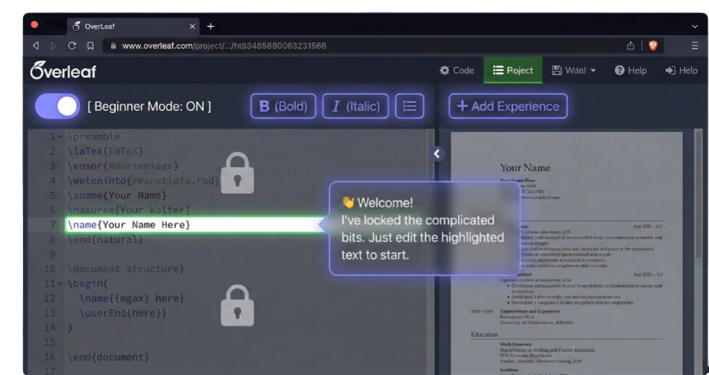

# EasyLeaf Landing Page

This is the official landing page for EasyLeaf, a browser extension that makes Overleaf beginner-friendly.



## ✨ Features

*   **Modern & Responsive Design:** Built with Tailwind CSS for a beautiful and responsive layout on all devices.
*   **Component-Based:** Developed with React, featuring a clean and modular component structure.
*   **Clear & Concise Information:** The landing page effectively communicates the value proposition of the EasyLeaf extension.
*   **Engaging Visuals:** Includes high-quality images and icons to create an engaging user experience.

## 🚀 Technologies Used

*   **[React](https://reactjs.org/)**: A JavaScript library for building user interfaces.
*   **[TypeScript](https://www.typescriptlang.org/)**: A typed superset of JavaScript that compiles to plain JavaScript.
*   **[Tailwind CSS](https://tailwindcss.com/)**: A utility-first CSS framework for rapid UI development.
*   **[Lucide React](https://lucide.dev/)**: A library of simply beautiful icons.

## 🛠️ Getting Started

To get a local copy up and running, follow these simple steps.

### Prerequisites

*   **Node.js**: Make sure you have Node.js installed. You can download it from [here](https://nodejs.org/).
*   **npm**: npm is included with Node.js.

### Installation

1.  Clone the repo
    ```sh
    git clone https://github.com/your_username/easyleaf-landing-page.git
    ```
2.  Install NPM packages
    ```sh
    npm install
    ```

### Running the Application

To run the app in development mode:

```sh
npm start
```

Open [http://localhost:3000](http://localhost:3000) to view it in the browser. The page will reload if you make edits.

## 📜 Available Scripts

In the project directory, you can run:

*   `npm start`: Runs the app in the development mode.
*   `npm test`: Launches the test runner in the interactive watch mode.
*   `npm run build`: Builds the app for production to the `build` folder.
*   `npm run eject`: Removes the single build dependency from your project.

## 🤝 Contributing

Contributions, issues, and feature requests are welcome!

## 📝 License

This project is licensed under the MIT License.